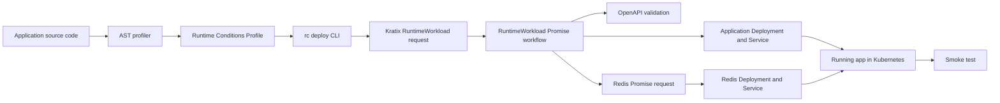

# Runtime Conditions + Kratix: First End-to-End Implementation Proposal

## Purpose

This document proposes the first working implementation of Runtime Conditions as a deployment accelerator for application developers and platform engineers.

The goal is not to prove that a YAML profile can be generated. The goal is to prove that declarations in application code can drive a real Kubernetes deployment through Kratix, including API contract validation and provisioning of at least one architectural dependency such as a cache or database.

The demonstration should show a complete path:

1. A developer declares runtime integrations in source code.
2. The AST profiler generates a Runtime Conditions Profile.
3. A deployment command submits that profile to Kratix.
4. Kratix validates declared API integrations against published OpenAPI documents.
5. Kratix provisions required platform resources, starting with Redis.
6. Kratix deploys the application into Kubernetes with the required bindings.
7. A smoke test proves the deployed app can use both the API dependency and the provisioned resource.
8. A breaking OpenAPI change prevents deployment and reports why.

## Primary Audience

This proposal is written for:

- application developers who want less manual deployment configuration
- platform engineers who operate Kubernetes and Kratix
- architects evaluating whether Runtime Conditions adds value beyond catalog or infrastructure metadata
- engineering leaders looking for a concrete demonstration of deployment automation

## Guiding Principle

Runtime Conditions should be the demand-side signal extracted from application code.

Kratix should be the platform execution mechanism that turns that demand into provisioned resources, Kubernetes workloads, and visible status.

The first implementation should avoid inventing a parallel platform model. It should use Kratix Promises, Kubernetes custom resources, Kubernetes Deployments and Services, and Backstage-compatible API catalog entries where useful.

## Non-Goals for the First Implementation

The first implementation should not attempt to solve everything.

Out of scope for the first pass:

- production-grade managed AWS services
- a fully operated Backstage instance
- Crossplane integration
- OpenTofu integration
- service mesh and mTLS enforcement
- multiple environments
- advanced policy engines
- all Runtime Conditions extension mechanisms
- complete JSON Schema compatibility semantics

Those are important, but they should come after the first executable proof.

## Target Outcome

The target outcome is a repeatable demo command that deploys a real application to Kubernetes through Kratix:

```bash
rc deploy ./go/apps/request-logger \
  --image ghcr.io/example/request-logger:dev \
  --namespace demo
```

That command should:

1. run the Go or Python AST profiler
2. generate a Runtime Conditions Profile
3. create or update a Kratix `RuntimeWorkload` resource request
4. wait for Kratix workflow completion
5. wait for the application Deployment to become available
6. run a smoke test against the deployed app

A successful demo should end with evidence from Kubernetes, not just generated files:

```bash
kubectl get runtimeworkload request-logger -n demo
kubectl get redis request-logger-cache -n demo
kubectl get deployment request-logger -n demo
kubectl port-forward svc/request-logger 8080:8080 -n demo
curl localhost:8080/demo
```

The `/demo` response should prove both integrations are working:

```json
{
  "todosApi": "ok",
  "cache": "ok"
}
```

## High-Level Architecture



## Kubernetes and Kratix Baseline

The first implementation should run on a real Kubernetes cluster.

For fast development, a disposable KinD or Minikube cluster is acceptable. For stakeholder demos, EKS is a better target because it matches the intended platform environment.

Kratix should be installed into the cluster before the demo. The Kratix quick start is useful for a disposable environment because it installs Kratix, Flux, and a local MinIO-backed state store. For a longer-lived EKS setup, use the full Kratix installation path instead.

The important point is that Kratix must actually be running and reconciling resources. The demo should not bypass Kratix by directly applying generated application manifests.

## Platform Components

The first implementation needs four platform-side pieces.

| Component | Purpose |
| --- | --- |
| `Redis` Promise | Provisions a real Redis Deployment and Service in Kubernetes |
| `RuntimeWorkload` Promise | Accepts a Runtime Conditions Profile and deploys the application |
| Runtime Conditions resolver image | Runs inside the `RuntimeWorkload` workflow |
| API catalog bundle | Stores Backstage-compatible API entities and OpenAPI documents |

## Application Components

The first demo should include at least two workloads.

| Workload | Purpose |
| --- | --- |
| `todos-api` | Provider API with a published OpenAPI document |
| `request-logger` | Consumer app that calls `todos-api` and uses Redis |

The consumer app should be deployed by Runtime Conditions through Kratix.

The provider API can be installed as part of demo setup. It represents a platform-supported or separately owned service that publishes an OpenAPI contract.

## Source Code Declaration Example

The consumer application declares its integrations in code.

Example Go declaration:

```go
var _ = rc.API("todos-api",
    rc.CatalogRef("api:default/todos-api"),
    rc.BaseURLEnv("TODOS_API_URL"),
    rc.GET("/todos/{id}",
        rc.Response[Todo](),
    ),
)

var _ = rc.Cache("request-cache",
    rc.Engine("redis"),
    rc.ConnectionEnv("REDIS_URL"),
)
```

The source code remains the source of truth for the integrations the application expects.

The declaration code is intentionally explicit. The profiler should not infer behavior by scanning arbitrary HTTP calls or Redis clients.

## Runtime Conditions Profile

The AST profiler generates a Runtime Conditions Profile from source declarations.

Example shape:

```yaml
apiVersion: runtimeconditions.dev/v1alpha1
workload:
  name: request-logger
conditions:
  apis:
    - name: todos-api
      catalogRef: api:default/todos-api
      baseUrlEnv: TODOS_API_URL
      operations:
        - method: GET
          path: /todos/{id}
          responseSchema:
            type: object
            required:
              - id
              - title
              - completed
            properties:
              id:
                type: integer
              title:
                type: string
              completed:
                type: boolean
  caches:
    - name: request-cache
      engine: redis
      connectionEnv: REDIS_URL
```

The profile expresses what the app needs. It does not decide how the platform fulfills those needs.

## Kratix `Redis` Promise

The first resource Promise should be deliberately simple.

The `Redis` Promise should expose a namespaced resource:

```yaml
apiVersion: runtimeconditions.io/v1alpha1
kind: Redis
metadata:
  name: request-logger-cache
  namespace: demo
spec:
  size: small
```

Its configure workflow writes Kubernetes manifests to `/kratix/output`:

- Redis `Deployment`
- Redis `Service`
- optional `Secret` or `ConfigMap` if connection data is needed

It writes status to `/kratix/metadata/status.yaml`:

```yaml
message: Redis cache provisioned
connectionDetails:
  host: request-logger-cache.demo.svc.cluster.local
  port: 6379
  url: redis://request-logger-cache.demo.svc.cluster.local:6379
```

For the demo, this can be an in-cluster Redis deployment. Later, the same Promise API can be reimplemented to provision ElastiCache, MemoryDB, or a Crossplane-managed Redis-compatible resource.

## Kratix `RuntimeWorkload` Promise

The `RuntimeWorkload` Promise is the main integration point.

It should expose a namespaced resource:

```yaml
apiVersion: runtimeconditions.io/v1alpha1
kind: RuntimeWorkload
metadata:
  name: request-logger
  namespace: demo
spec:
  image: ghcr.io/example/request-logger:dev
  port: 8080
  profile: |
    apiVersion: runtimeconditions.dev/v1alpha1
    workload:
      name: request-logger
    conditions:
      ...
  catalog:
    configMapRef:
      name: runtimeconditions-api-catalog
      namespace: runtimeconditions-system
```

Its configure workflow should run a Runtime Conditions resolver image.

The resolver should:

1. read `/kratix/input/object.yaml`
2. parse `spec.profile`
3. load the API catalog bundle
4. validate API conditions against OpenAPI
5. generate Redis resource requests for cache conditions
6. generate the application Deployment and Service
7. write generated resources to `/kratix/output`
8. write status to `/kratix/metadata/status.yaml`

Conceptually, this Promise behaves like a Kratix Compound Promise: it accepts one high-level request and emits lower-level resource requests and workload manifests.

## API Catalog and OpenAPI Validation

The first implementation should use Backstage-compatible API catalog entries, but should not require a running Backstage server.

Use a Kubernetes ConfigMap as the first catalog source:

```yaml
apiVersion: v1
kind: ConfigMap
metadata:
  name: runtimeconditions-api-catalog
  namespace: runtimeconditions-system
data:
  todos-api.catalog-info.yaml: |
    apiVersion: backstage.io/v1alpha1
    kind: API
    metadata:
      name: todos-api
    spec:
      type: openapi
      lifecycle: production
      owner: group:default/platform
      definition:
        $text: ./todos.openapi.yaml
  todos.openapi.yaml: |
    openapi: 3.0.3
    info:
      title: Todos API
      version: 1.0.0
    paths:
      /todos/{id}:
        get:
          responses:
            "200":
              description: Todo
              content:
                application/json:
                  schema:
                    type: object
                    required:
                      - id
                      - title
                      - completed
                    properties:
                      id:
                        type: integer
                      title:
                        type: string
                      completed:
                        type: boolean
```

The resolver should match Runtime Conditions API dependencies to catalog APIs in this order:

1. exact `catalogRef`
2. API name
3. method and path structural match

For the first implementation, response compatibility can be conservative:

- every required field in the Runtime Conditions response schema must exist in OpenAPI
- field types must match
- additional OpenAPI response fields are allowed
- missing required fields are breaking
- incompatible field types are breaking

Request body compatibility can be added in the same pattern once the demo includes a request body.

## Application Deployment Generation

If API validation passes, the `RuntimeWorkload` workflow emits:

- a Redis resource request for each Redis cache condition
- a Kubernetes `Deployment`
- a Kubernetes `Service`
- optional `ConfigMap` for non-secret environment variables

The generated Deployment should include environment variables derived from resolved conditions:

```yaml
env:
  - name: TODOS_API_URL
    value: http://todos-api.demo.svc.cluster.local:8080
  - name: REDIS_URL
    value: redis://request-logger-cache.demo.svc.cluster.local:6379
```

The app should expose a readiness probe that fails until both integrations are reachable. That keeps Kubernetes from marking the app ready before Redis or the provider API is available.

## Success Path

The successful demo flow should look like this:

```bash
make cluster-up
make install-kratix
make install-promises
make deploy-provider-api
make deploy-request-logger
make smoke-test
```

Expected visible results:

```bash
kubectl get runtimeworkload request-logger -n demo
kubectl get redis request-logger-cache -n demo
kubectl get deployment request-logger -n demo
kubectl get pods -n demo
curl localhost:8080/demo
```

The important demonstration point:

The developer did not manually author a Redis deployment, app deployment, environment binding, or API compatibility check. Those came from source declarations, Runtime Conditions, and Kratix.

## Failure Path: Breaking API Change

The demo should include an intentional breaking change.

For example, change the published OpenAPI schema:

```yaml
completed:
  type: string
```

The application code still expects:

```go
Completed bool `json:"completed"`
```

The Runtime Conditions resolver should reject the deployment:

```text
API contract validation failed

condition:
  api: todos-api
  operation: GET /todos/{id}

expected by workload:
  response.completed: boolean

published by catalog:
  response.completed: string

result:
  incompatible
```

The Kratix workflow should fail before writing the application Deployment to `/kratix/output`.

The platform engineer should be able to inspect the failure with:

```bash
kubectl describe runtimeworkload request-logger -n demo
kubectl get pods -n demo -l kratix.io/promise-name=runtime-workload
kubectl logs <workflow-pod> -n demo
```

The application should not be deployed with a known incompatible API contract.

## Proposed Repository Layout

```text
platform/
  README.md
  kratix/
    install/
      quickstart.md
    promises/
      redis/
        promise.yaml
        pipeline/
          Dockerfile
          configure.py
      runtime-workload/
        promise.yaml
        pipeline/
          Dockerfile
          resolver/
  catalog/
    apis/
      todos-api.catalog-info.yaml
      todos.openapi.yaml
      todos.openapi.breaking.yaml
  demo/
    provider/
      todos-api/
        main.go
        Dockerfile
        k8s.yaml
    consumer/
      go/
        main.go
        Dockerfile
      python/
        main.py
        Dockerfile
    scripts/
      smoke-test.sh
      break-openapi.sh
```

The existing Go and Python profilers can stay in their language-specific trees. The new `platform/` tree should contain the Kratix-specific implementation and demo assets.

## CLI Responsibilities

The `rc deploy` command should be a thin automation wrapper around existing tools.

It should:

1. detect Go or Python source
2. run the correct AST profiler
3. produce the Runtime Conditions Profile
4. create the `RuntimeWorkload` request
5. apply it with `kubectl`
6. wait for Kratix workflow completion
7. wait for the app Deployment
8. optionally run the smoke test

It should not bypass Kratix.

It should not directly apply Redis or app manifests.

## Milestones

### Milestone 1: Kubernetes and Kratix Baseline

Deliverables:

- documented cluster requirements
- Kratix installation script or Make target
- namespace setup
- validation that Kratix controllers are running

Acceptance criteria:

```bash
kubectl get pods -n kratix-platform-system
kubectl get crds -l kratix.io/promise-name
```

### Milestone 2: Redis Promise

Deliverables:

- `Redis` Promise
- Redis configure workflow image
- generated Redis Deployment and Service
- status output with connection details

Acceptance criteria:

```bash
kubectl apply -f examples/redis-request.yaml
kubectl wait redis/request-logger-cache -n demo \
  --for=condition=ConfigureWorkflowCompleted \
  --timeout=120s
kubectl get svc request-logger-cache -n demo
```

### Milestone 3: RuntimeWorkload Promise

Deliverables:

- `RuntimeWorkload` Promise
- resolver workflow image
- support for embedded Runtime Conditions Profile
- generated app Deployment and Service

Acceptance criteria:

```bash
kubectl apply -f examples/runtimeworkload-request.yaml
kubectl wait runtimeworkload/request-logger -n demo \
  --for=condition=ConfigureWorkflowCompleted \
  --timeout=120s
kubectl get deployment request-logger -n demo
```

### Milestone 4: API Contract Validation

Deliverables:

- Backstage-compatible API catalog bundle
- OpenAPI loading
- method/path matching
- response schema compatibility check
- failure reporting

Acceptance criteria:

- compatible OpenAPI allows deployment
- incompatible OpenAPI blocks deployment
- workflow logs clearly explain the mismatch

### Milestone 5: End-to-End Demo

Deliverables:

- provider API deployed in Kubernetes
- consumer app deployed through `RuntimeWorkload`
- Redis provisioned through Kratix
- smoke test script

Acceptance criteria:

```bash
make demo
```

Results in:

- `todos-api` running
- `request-logger` running
- Redis running
- `/demo` confirms API and Redis success

### Milestone 6: Breaking Change Demo

Deliverables:

- script to swap in a breaking OpenAPI document
- redeploy attempt
- expected failure path

Acceptance criteria:

```bash
make demo-breaking-change
```

Results in:

- RuntimeWorkload workflow failure
- app deployment blocked
- clear contract mismatch in logs/status

## What This Demonstrates

For developers:

- integration declarations live in source code
- less hand-authored deployment configuration
- API contract failures surface before deployment
- platform dependencies can be requested automatically

For platform engineers:

- Runtime Conditions becomes a structured input to Kratix
- Promises remain the platform abstraction
- resources are still provisioned through platform-owned APIs
- deployment automation is visible through Kubernetes and Kratix status
- the platform can enforce compatibility before workloads are released

For architects:

- Runtime Conditions does not replace Backstage, Kratix, or Kubernetes
- Runtime Conditions provides source-derived demand
- Kratix provides supply-side fulfillment and orchestration
- Backstage-compatible API entities provide published contract metadata

## Risks and Design Choices

### Running Backstage Is Deferred

The first implementation should use Backstage-compatible catalog YAML and OpenAPI documents, but not require operating Backstage.

This keeps the first demo focused on deployment automation. A later adapter can replace the ConfigMap catalog source with calls to the Backstage Catalog API.

### Redis Is In-Cluster First

The first Redis Promise should create an in-cluster Redis instance.

This is not the production target, but it proves the Kratix request and binding flow. The Promise can later be reimplemented to provision AWS-backed services without changing application declarations.

### API Compatibility Starts Conservative

The first schema comparison should focus on required response fields and primitive types.

This is enough to prove value. More complete JSON Schema and OpenAPI compatibility rules can be added once the end-to-end path works.

### Application Readiness Must Wait for Dependencies

The generated Deployment should rely on app readiness probes to avoid reporting success before Redis or the API provider is reachable.

This avoids needing the RuntimeWorkload workflow to synchronously wait for every generated sub-resource before writing the app manifests.

## Follow-On Integrations

Once this first implementation is working, the natural next steps are:

- use a live Backstage Catalog API instead of a ConfigMap catalog bundle
- replace in-cluster Redis with a managed Redis or ElastiCache Promise
- add PostgreSQL as the first datastore Promise
- add Crossplane-backed implementations behind Kratix Promises
- add OpenTofu-backed implementations behind Kratix Promises
- publish Runtime Conditions status back into Backstage
- add Cilium network policy generation
- add mTLS/service mesh policy generation
- support multiple deployment environments

## References

- [Kratix Introduction](https://docs.kratix.io/)
- [Kratix Quick Start](https://docs.kratix.io/main/quick-start)
- [Kratix Promises](https://docs.kratix.io/main/reference/promises/intro)
- [Kratix Workflows](https://docs.kratix.io/main/reference/workflows)
- [Kratix Resource Requests](https://docs.kratix.io/main/reference/resources/intro)
- [Kratix Resource Status](https://docs.kratix.io/main/reference/resources/status)
- [Kratix Compound Promises](https://docs.kratix.io/main/reference/promises/compound)
- [Backstage Catalog Descriptor Format](https://backstage.io/docs/features/software-catalog/descriptor-format/)
