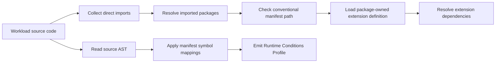

# Generator Discovery and End-User Workflow

## Status

**Non-normative implementation guidance**

This guide documents how a first-party generator discovers Runtime Conditions package manifests from imported libraries and how an end user benefits from those manifests when generating workload profiles.

---

# 1. Discovery Model

Generators should discover Runtime Conditions metadata from direct imports, not by scanning entire dependency trees.

The intended flow is:



This avoids expensive scans of directories such as `node_modules`, Maven caches, Python virtual environments, or transitive Go module caches.

---

# 2. Current Go Generator Workflow

The current Go demo generator performs these steps:

1. Parse workload Go source files.
2. Collect direct import paths from those files.
3. Find the nearest `go.mod` for the workload.
4. Resolve direct imports using the module path and local `replace` directives.
5. Check each resolved direct import directory for `runtimeconditions.package.yaml`.
6. Load the package manifest.
7. Load the extension definition referenced by the package manifest.
8. Parse the workload AST.
9. Match constructor calls, receiver method calls, and explicit Runtime Conditions declarations.
10. Emit a Runtime Conditions Profile.

The generator does not need `-extensions-root` for package manifests shipped by imported SDK packages.

The `-extensions-root` flag is useful for local extension catalogs and manifests loaded from explicit extension roots, while SDK package manifests are discovered from imports.

---

# 3. Demo Walkthrough

The current request logger demo imports explicit first-party declaration packages:

```go
import (
	common "github.com/colinjlacy/runtime-conditions-profiles/extensions/common-integrations/go"
	env "github.com/colinjlacy/runtime-conditions-profiles/extensions/env-configuration/go"
)
```

The workload declares an HTTP API and Redis cache:

```go
common.API("todos-api",
	common.Spec("openapi", "catalog://api/default/todos-api", "1.0.0"),
	common.GET("/todos/{id}", common.Response[Todo]()),
	env.Env("baseUrl", "TODOS_API_URL"),
)

common.Cache("request-cache",
	common.KeyValue(common.Redis),
	env.EnvAlternative(env.Env("url", "REDIS_URL")),
	env.EnvAlternative(
		env.Env("hostname", "REDIS_HOST"),
		env.Env("port", "REDIS_PORT"),
	),
)
```

Running the generator:

```sh
cd go/profiler
go run . \
  -dir ../../demos/apps/request-logger-http \
  -name request-logger-http \
  -workload-uri github.com/colinjlacy/runtime-conditions-profiles/demos/apps/request-logger-http \
  -workload-version v0.1.0
```

produces a profile that includes the directly used declaration package extensions:

```yaml
extensions:
  - https://runtimeconditions.io/extensions/common-integrations:v1alpha1
  - https://runtimeconditions.io/extensions/env-configuration:v1alpha1

conditions:
  - name: todos-api
    kind: api
    interface:
      type: http
    configuration:
      env:
        - property: baseUrl
          name: TODOS_API_URL
  - name: request-cache
    kind: cache
    interface:
      type: key_value
      engine: redis
    configuration:
      alternatives:
        - env:
            - property: url
              name: REDIS_URL
        - env:
            - property: hostname
              name: REDIS_HOST
            - property: port
              name: REDIS_PORT
```

The `todos-api` and `request-cache` Conditions come from explicit first-party declaration package calls in the workload. A workload that also imports an SDK package with a manifest can emit additional SDK-discovered Conditions from that SDK usage.

The profile records the environment variable names expected by the workload. It does not contain the values for those variables. In the Kratix demo, the `ApplicationRelease` Promise resolver maps these requested properties to platform-owned outputs:

| Condition property | Kubernetes source |
| ---- | ---- |
| `baseUrl` | Literal service URL from the API catalog |
| `url`, `hostname`, `port` | Redis service address rendered from the generated Redis request |

The resolver applies platform context in two steps:

- API Conditions are validated against the catalog OpenAPI document before the workload Deployment is emitted.
- Redis cache Conditions emit a `Redis` request and bind the generated service address into the workload environment.

The generator still emits only the Runtime Conditions Profile. `ApplicationRelease` resolution and Kubernetes resources are adapter output.

---

# 4. Extension Dependency Resolution

Package manifests identify the extension used by generated Conditions:

```yaml
extension:
  id: https://aws.example.com/runtimeconditions/object-store:v1alpha1
  definition: ../../../../extensions/aws-object-store/aws-object-store-v1alpha1.yaml
```

The extension definition declares its dependencies:

```yaml
spec:
  dependencies:
    - https://runtimeconditions.io/extensions/common-integrations:v1alpha1
    - https://runtimeconditions.io/extensions/env-configuration:v1alpha1
```

Generators and validators should resolve dependencies by extension identifier from configured sources such as:

- Bundled first-party extension definitions
- Local extension roots
- Local cache
- Organization registry
- Public registry

Extensions are standalone artifacts. A workload or adapter can use an extension without using the SDK that originally motivated it. SDK packages that participate in generation must reference an extension definition from their package manifest; they do not define vocabulary inside the package manifest itself.

SDK packages do not need to physically include every transitive dependency extension file. Dependencies are resolved from configured catalogs, registries, caches, or local extension roots.

---

# 5. End-User Workflow

An application developer using third-party SDK support should be able to follow this workflow:

1. Add or update the SDK dependency as usual.
2. Write normal application code against the SDK.
3. Add explicit Runtime Conditions declarations only for unsupported SDKs, raw HTTP calls, or app-specific integrations.
4. Run the language generator.
5. Review the generated Runtime Conditions Profile.
6. Validate the profile against the core spec and resolved extensions.
7. Pass the validated profile to an adapter or platform workflow.

The end user should not need to add a separate application config file just to enable SDK Condition discovery.

---

# 6. Diagnostics

Generators SHOULD produce actionable diagnostics for malformed package metadata.

Examples:

| Case | Diagnostic Category |
| ---- | ------------------- |
| Imported package has malformed `runtimeconditions.package.yaml` | `package-manifest` |
| Manifest references a missing extension file | `package-extension` |
| Manifest references an unsupported language section | `package-language` |
| Manifest maps a method that cannot be matched statically | `package-mapping` |
| Extension dependency cannot be resolved | `extension-dependency` |
| Generated vocabulary is not defined by resolved extensions | `unresolved-vocabulary` |

Generators SHOULD NOT fail merely because an imported package does not include a Runtime Conditions manifest. Most libraries will not participate in this convention.

Generators SHOULD fail before emitting a profile when a discovered manifest is malformed or would emit unresolved vocabulary.

---

# 7. Dedupe and Aggregation

A generator may see the same SDK method called many times.

SDK package manifests SHOULD choose stable Condition names so generators can deduplicate repeated calls.

Example:

```yaml
declarations:
  - receiver: Client
    method: PutObject
    name: s3-object-store
    kind: aws.object_store
    interfaceType: aws.s3
```

If a workload calls `PutObject` in five places, the generated profile should normally contain one `s3-object-store` Condition unless the manifest defines a static and safe way to distinguish multiple integration requirements.

---

# 8. Unsupported Integrations

Package manifest discovery is additive. It does not replace explicit declarations.

For raw HTTP calls or SDKs without package manifests, developers can still write explicit declarations:

```go
common.API("todos-api",
	common.Spec("openapi", "catalog://api/default/todos-api", "1.0.0"),
	common.GET("/todos/{id}", common.Response[Todo]()),
)
```

This preserves a practical escape hatch while allowing richer SDKs to surface their internal Conditions automatically.
