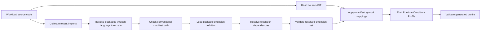

# Generator Discovery and End-User Workflow

## Status

**Non-normative implementation guidance**

This guide documents how a first-party generator discovers Runtime Conditions manifests from imported packages and how an end user benefits from those manifests when generating workload profiles.

---

# 1. Discovery Model

Generators should discover Runtime Conditions metadata from packages resolved by the language-native toolchain and package manager. They should inspect the packages that can contribute source-level declarations or SDK and production library mappings, not crawl arbitrary dependency cache directories looking for manifests.

A generator may discover two manifest types:

- `runtimeconditions.bindings.yaml` maps declarative Runtime Conditions helper APIs to extension-owned vocabulary.
- `runtimeconditions.package.yaml` maps SDK or production library APIs to extension-owned vocabulary.

Both manifest types resolve a `runtimeconditions.extension.yaml` definition, or an explicit vendored or local override path, before their mappings are trusted.

The intended flow is:



This keeps the language package manager as the source of truth for package versions and avoids expensive scans of directories such as `node_modules`, Maven caches, Python virtual environments, or transitive Go module caches.

---

# 2. Current Generator Workflow

The current generator flow is language-neutral at the package artifact level. The implemented Go path uses `go.mod`; additional language paths should use their native dependency lists, such as `package.json`, `pyproject.toml`, or comparable package manager metadata.

1. Parse workload source files.
2. Collect import paths that may contribute declaration, SDK, or production library mappings.
3. Resolve the workload's code dependency list.
4. Resolve imports using the language-native package manager and local override rules.
5. Check each resolved import package for `runtimeconditions.bindings.yaml` or `runtimeconditions.package.yaml`.
6. Load each discovered manifest.
7. Load `runtimeconditions.extension.yaml` from the resolved package artifact, or a manifest-referenced vendored/development override.
8. Resolve the direct extension's declared dependency extension identifiers.
9. Validate the cumulative extension definition set and discovered manifests.
10. Parse the workload AST.
11. Match constructor calls, receiver method calls, and explicit Runtime Conditions declarations.
12. Emit and validate a Runtime Conditions Profile.

The generator does not need `-extensions-root` for manifests shipped by imported packages.

The `-extensions-root` flag is a development override for local extension definitions. Binding and package manifests are discovered from resolved imports.

---

# 3. Demo Walkthrough

The current request logger demo imports explicit first-party declaration packages:

```go
import (
	common "github.com/colinjlacy/runtime-conditions-profiles/extensions/common-integrations/go"
	env "github.com/colinjlacy/runtime-conditions-profiles/extensions/env-configuration/go"
)
```

The workload declares an HTTP API and Redis cache:

```go
common.API("todos-api",
	common.Spec("openapi", "catalog://api/default/todos-api", "1.0.0"),
	common.GET("/todos/{id}", common.Response[Todo]()),
	env.Env("baseUrl", "TODOS_API_URL"),
)

common.Cache("request-cache",
	common.KeyValue(common.Redis),
	env.EnvAlternative(env.Env("url", "REDIS_URL")),
	env.EnvAlternative(
		env.Env("hostname", "REDIS_HOST"),
		env.Env("port", "REDIS_PORT"),
	),
)
```

Running the generator:

```sh
cd go/profiler
go run . \
  -dir ../../demos/apps/request-logger-http \
  -name request-logger-http \
  -workload-uri github.com/colinjlacy/runtime-conditions-profiles/demos/apps/request-logger-http \
  -workload-version v0.1.0
```

produces a profile that includes the directly used declaration package extensions:

```yaml
extensions:
  - https://runtimeconditions.io/extensions/common-integrations/v1alpha1/runtimeconditions.extension.yaml
  - https://runtimeconditions.io/extensions/env-configuration/v1alpha1/runtimeconditions.extension.yaml

conditions:
  - name: todos-api
    kind: api
    interface:
      type: http
    configuration:
      env:
        - property: baseUrl
          name: TODOS_API_URL
  - name: request-cache
    kind: cache
    interface:
      type: key_value
      engine: redis
    configuration:
      alternatives:
        - env:
            - property: url
              name: REDIS_URL
        - env:
            - property: hostname
              name: REDIS_HOST
            - property: port
              name: REDIS_PORT
```

The `todos-api` and `request-cache` Conditions come from explicit first-party declaration package calls in the workload. A workload that also imports an SDK or production library package with a manifest can emit additional package-discovered Conditions from that source usage.

The profile records the environment variable names expected by the workload. It does not contain the values for those variables. In the Kratix demo, the `ApplicationRelease` Promise resolver maps these requested properties to platform-owned outputs:

| Condition property | Kubernetes source |
| ---- | ---- |
| `baseUrl` | Literal service URL from the API catalog |
| `url`, `hostname`, `port` | Redis service address rendered from the generated Redis request |

The resolver applies platform context in two steps:

- API Conditions are validated against the catalog OpenAPI document before the workload Deployment is emitted.
- Redis cache Conditions emit a `Redis` request and bind the generated service address into the workload environment.

The generator still emits only the Runtime Conditions Profile. `ApplicationRelease` resolution and Kubernetes resources are adapter output.

---

# 4. Extension Dependency Resolution

Package manifests identify the extension used by generated Conditions with `extension.id`:

```yaml
extension:
  id: https://aws.example.com/runtimeconditions/object-store/v1alpha1/runtimeconditions.extension.yaml
```

Binding manifests use `metadata.extension` for the same purpose.

The extension definition declares its dependencies:

```yaml
spec:
  dependencies:
    - https://runtimeconditions.io/extensions/common-integrations/v1alpha1/runtimeconditions.extension.yaml
    - https://runtimeconditions.io/extensions/env-configuration/v1alpha1/runtimeconditions.extension.yaml
```

Generators and validators should resolve the direct extension definition from the resolved code package whenever possible. They then resolve dependency extension identifiers from configured sources such as package-local artifacts, local caches, organization registries, public registries, or development roots.

Extensions are standalone artifacts. A workload or adapter can use an extension without using the SDK or production library that originally motivated it. Packages that participate in generation must reference an extension definition from their manifest; they do not define vocabulary inside the manifest itself.

Packages do not need to physically include every transitive dependency extension file. Dependencies are resolved from exact extension identifiers after the package-owned extension definition is loaded.

---

# 5. End-User Workflow

An application developer using third-party SDK or production library support should be able to follow this workflow:

1. Add or update the dependency as usual.
2. Write normal application code against the SDK or production library.
3. Add explicit Runtime Conditions declarations only for unsupported packages, raw HTTP calls, or app-specific integrations.
4. Run the language generator.
5. Review the generated Runtime Conditions Profile.
6. Validate the profile against the core spec and resolved extensions.
7. Pass the validated profile to an adapter or platform workflow.

The end user should not need to add a separate application config file just to enable package-based Condition discovery.

---

# 6. Diagnostics

Generators SHOULD produce actionable diagnostics for malformed package metadata.

Examples:

| Case | Diagnostic Category |
| ---- | ------------------- |
| Imported package has malformed `runtimeconditions.bindings.yaml` | `package-manifest` |
| Imported package has malformed `runtimeconditions.package.yaml` | `package-manifest` |
| Manifest references a missing extension file | `package-extension` |
| Manifest references an unsupported language section | `package-language` |
| Manifest maps a method that cannot be matched statically | `package-mapping` |
| Extension dependency cannot be resolved | `extension-dependency` |
| Generated vocabulary is not defined by resolved extensions | `unresolved-vocabulary` |

Generators SHOULD NOT fail merely because an imported package does not include a Runtime Conditions manifest. Most libraries will not participate in this convention.

Generators SHOULD fail before emitting a profile when a discovered manifest is malformed or would emit unresolved vocabulary.

---

# 7. Dedupe and Aggregation

A generator may see the same SDK or production library method called many times.

Package manifests SHOULD choose stable Condition names so generators can deduplicate repeated calls.

Example:

```yaml
declarations:
  - receiver: Client
    method: PutObject
    name: s3-object-store
    kind: aws.object_store
    interfaceType: aws.s3
```

If a workload calls `PutObject` in five places, the generated profile should normally contain one `s3-object-store` Condition unless the manifest defines a static and safe way to distinguish multiple integration requirements.

---

# 8. Unsupported Integrations

Package manifest discovery is additive. It does not replace explicit declarations.

For raw HTTP calls, SDKs, or production libraries without package manifests, developers can still write explicit declarations:

```go
common.API("todos-api",
	common.Spec("openapi", "catalog://api/default/todos-api", "1.0.0"),
	common.GET("/todos/{id}", common.Response[Todo]()),
)
```

This preserves a practical escape hatch while allowing richer packages to surface their internal Conditions automatically.
