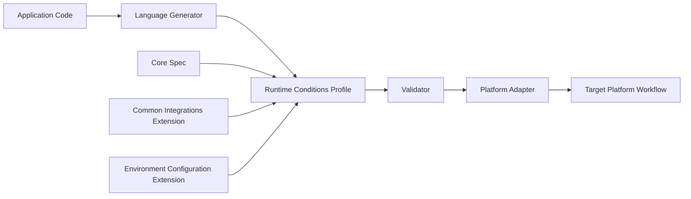

# Runtime Conditions Profile RFC

This repository contains the working draft of the Runtime Conditions Profile specification and supporting first-party extension drafts.

The Runtime Conditions Profile is intended to provide a portable, implementation-neutral declaration of the external runtime integrations an application workload requires. The profile describes requirements, not provisioning choices, deployment topology, infrastructure resources, credentials, or concrete target-environment values.

The current draft is organized around a small core specification and extension-backed practical vocabulary. The core defines the document shape and interoperability contract. Extensions define the concrete runtime condition vocabulary that makes profiles useful for real workloads.

---

# How to Read This RFC

Read the documents in this order:

1. [Core Runtime Conditions Profile draft](fifth-draft.md)
2. [Common Integrations extension](../extensions/common-integrations/README.md)
3. [Environment Configuration extension](../extensions/env-configuration/README.md)
4. [Kratix implementation proposal](core/kratix-runtime-conditions-implementation-proposal.md)

The core draft should be reviewed as the specification kernel. It defines:

- Profile envelope
- Workload identity
- Profile labels
- Extension declarations
- Condition object shape
- Interface object shape
- Validation phases
- Extension resolution
- Vocabulary ownership rules
- Conformance expectations for profiles, extensions, generators, validators, and adapters

The first-party extensions should be reviewed as standard vocabulary that can be bundled by implementations while still remaining outside the core specification.

The implementation proposal should be reviewed as a non-normative feasibility exercise. It demonstrates how generated Runtime Conditions Profiles can be used by a platform workflow, but it is not intended to define the specification itself.

---

# Specification Shape

The RFC is split into three layers.

## 1. Core Runtime Conditions Profile

The core specification defines the portable document contract:

```yaml
apiVersion: runtimeconditions.io/v1alpha1
kind: RuntimeConditionsProfile

metadata:
  name: example-profile
  labels:
    owner.example.com/team: platform
    lifecycle.example.com/stage: production

workload:
  uri: https://github.com/example-org/example-service
  version: v1.2.3

extensions: []

conditions: []
```

A core-only profile can be structurally valid, but it does not describe operational runtime dependencies unless extension-defined vocabulary is declared and used.

The core Condition shape is:

```yaml
conditions:
  - name: optional-condition-name
    kind: extension-defined-kind
    optional: false
    interface:
      type: extension-defined-interface-type
```

The core specification owns this object model. Extensions own the concrete values for `kind`, `interface.type`, extension-defined fields, and extension-defined field values.

## 2. First-Party Standard Extensions

First-party extensions define common vocabulary expected to cover the initial majority use cases.

The Common Integrations extension defines common integration kinds and interface types, including:

- `api`
- `datastore`
- `cache`
- HTTP API interfaces
- Relational and document datastore interfaces
- Key/value cache interfaces
- Common engine values such as `postgres`, `mysql`, `redis`, and `memcached`

The Environment Configuration extension defines workload configuration inputs, including:

- Environment variable names read by the workload
- Standard connection properties represented by those environment variables
- Sensitive inputs
- Required and optional inputs
- Alternative configuration sets such as `REDIS_URL` versus `REDIS_HOST` and `REDIS_PORT`

These extensions are first-party, but they are not core vocabulary. Profiles that use them must declare them.

## 3. Examples and Implementation Guidance

Examples and implementation documents should show how the core and extensions work together:

- A structurally valid core-only profile
- A profile using common integrations
- A profile using common integrations plus environment configuration
- A generated profile produced from application code
- A platform workflow that validates the profile, ensures required integrations exist, and injects workload configuration inputs before deployment

Implementation documents should remain non-normative unless a specific behavior is promoted into the core spec or a first-party extension.

---

# Architecture



The expected flow is:

1. Application code declares or implies runtime integration requirements.
2. A language-specific generator produces a Runtime Conditions Profile.
3. The generated profile declares the extensions required to interpret its vocabulary.
4. A validator checks the core structure, extension resolution, vocabulary ownership, and extension JSON Schema validation.
5. A platform adapter maps valid Conditions to available platform integrations.
6. Platform automation ensures required integrations exist and provides declared workload configuration inputs.
7. The workload is deployed only after required runtime conditions can be satisfied.

---

# Core Versus Extensions

The core specification exists to define a stable interchange contract. It intentionally avoids owning concrete runtime integration vocabulary.

Core owns:

- Document structure
- Workload identity
- Metadata labels
- Extension declaration mechanics
- Condition object structure
- Interface object structure
- Validation layers
- Extension ownership and conflict rules
- Conformance expectations

Extensions own:

- Concrete Condition kinds
- Concrete interface types
- Additional Condition fields
- Additional interface fields
- Field values such as engine names
- JSON Schema validation schemas for those fields and values

This split is important because a small core can stay stable while integration vocabulary evolves through extensions.

---

# Why First-Party Extensions Matter

A profile that only uses the core specification is mostly a structural conformance document. Real application profiles are expected to use extensions.

First-party extensions make the RFC practical without overloading the core specification. They provide a standard vocabulary for common workloads while keeping the extension model honest:

- Implementations may bundle first-party extensions for developer ergonomics.
- Generated profiles must still declare the vocabulary they use.
- Validators must still resolve extension ownership and conflicts.
- Other extensions can depend on first-party extensions instead of redefining their vocabulary.

This allows the specification to support a useful default experience while preserving room for vendor, platform, domain, and ecosystem-specific extensions.

---

# Review Focus

The most useful feedback at this stage is architectural feedback on:

- Whether the core Condition shape is sufficient
- Whether the core/extension boundary is clear
- Whether first-party extensions provide enough practical vocabulary
- Whether extension ownership and conflict rules are deterministic enough
- Whether the Environment Configuration extension correctly captures workload configuration inputs without embedding target-environment values
- Whether validators and adapters have enough information to behave consistently across implementations
- Whether the profile is useful to both generators and platform adapters

The intent is not to standardize one implementation workflow. The intent is to standardize the profile contract that lets generators, validators, extensions, and platform adapters interoperate.
