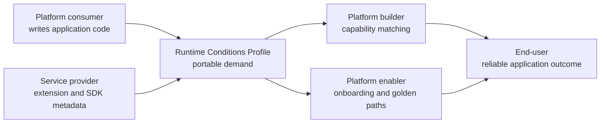
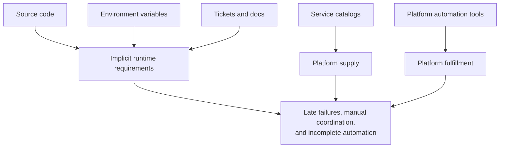
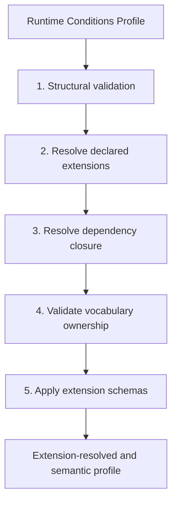
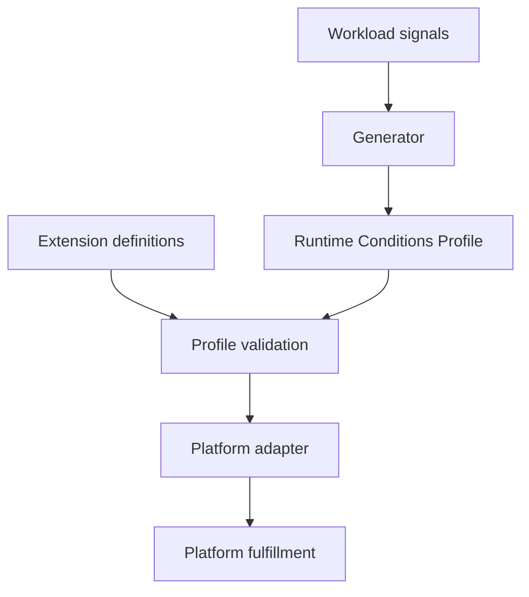
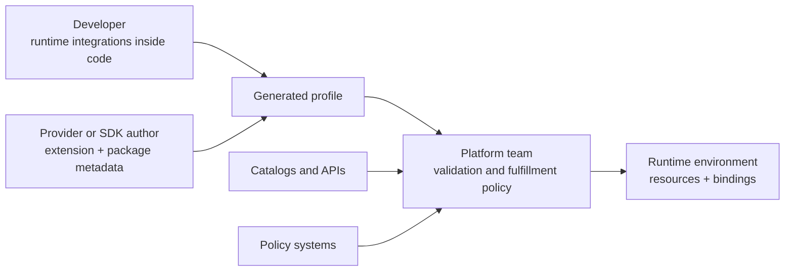

# Runtime Conditions Profiles: Portable Runtime Requirements for Cloud-Native and AI-Native Workloads

## Status

Working draft for review.

This document is a white paper source draft. It is intentionally broader than the Runtime Conditions Profile specification. The specification defines the profile format and extension model; this paper explains the problem space, use cases, tooling model, platform impact, and ecosystem opportunities around that specification.

---

# 1. Executive Summary

Cloud-native platforms have become increasingly capable at provisioning infrastructure, exposing reusable services, enforcing policy, and automating deployment. Yet applications still lack a portable, machine-readable way to declare the runtime capabilities they require. Data stores, APIs, queues, model-serving accelerators, and configuration inputs are often scattered across source code, environment variables, deployment manifests, IaC tools, service catalog entries, tickets, and human memory.

Runtime Conditions Profiles address that gap. A Runtime Conditions Profile declares the external runtime integrations required by one application workload. It gives application code, platform automation, policy systems, catalogs, AI agents, and review workflows a shared contract for reasoning about runtime requirements before deployment:

- Profiles describe demand.
- Platforms decide fulfillment.
- Generators can derive profiles from source code and package metadata.
- Validators can check profile structure, extension vocabulary, and semantic rules.
- Adapters can map valid profile demands to platform capabilities, provider APIs, catalog entries, policy checks, and deployment outputs.

Runtime Conditions Profiles do not provision infrastructure by themselves. The profile is a data contract. Its value comes from the tools and communities that consume it: generators, validators, platform adapters, and the broader ecosystem integrations built around them.

The current specification keeps the core small. The profile format defines the document envelope, comprised of:

- workload identity
- extension declarations
- essential metadata
- list of conditions that must be met
- a minimal condition object shape

Extensions define concrete vocabulary for conditions such as `api`, `cache`, `datastore`, environment variable mappings, and other domain-specific capabilities.

This approach supports a practical cloud-native workflow:

1. Developers declare runtime integrations inside code, or import SDKs, such as cloud provider or SaaS API SDKs, that publish their own condition metadata.
2. Language-native generators inspect source code and resolved packages without executing workload code.
3. Generated profiles list workload runtime conditions and the extensions required to interpret them, including SDK-based conditions.
4. Validators resolve and validate extension definitions and reject unresolved or conflicting vocabulary.
5. Platform adapters fulfill the profile against the target environment.

For platform engineering, this creates a clean contract between application intent and platform capability. For CNCF ecosystems, it offers a portable dependency representation that can interoperate with projects such as Score, Radius, Crossplane, Backstage, and policy engines. For Agentic Ops, it gives operations agents structured runtime context for inspecting demand, identifying gaps, and validating fulfillment. For agent development, the same model can describe the runtime dependencies of MCP servers, model-serving applications, and agent harnesses.

---

# 2. Platform Personas and Stakeholder Context

The CNCF Platforms White Paper defines a platform for cloud-native computing as an integrated collection of capabilities presented according to the needs of its users. Related TAG App Delivery writing on Platform as a Product emphasizes that platforms serve multiple personas: builders, enablers, consumers, end-users, and service providers.

Runtime Conditions Profiles matter because each of these personas sees runtime dependencies from a different angle.

| Persona | What They Need | How Runtime Conditions Help |
| --- | --- | --- |
| Platform builders | A stable way to expose capabilities without hard-coding every application path. | Profiles provide a demand-side contract that platform components can consume without owning application source analysis. |
| Platform enablers | A way to help teams onboard applications and compose platform capabilities. | Profiles reveal which runtime integrations a workload needs and whether the platform can satisfy them. |
| Platform consumers | A way to express application needs without becoming infrastructure experts. | Developers declare runtime integrations inside code or use SDKs that publish metadata. |
| End-users | Reliable applications that reach production safely. | Profile-aware validation can catch missing dependencies, incompatible APIs, or unsatisfied runtime requirements before rollout. |
| Service providers | A way to integrate offerings into platform workflows and developer tools. | Providers can publish extension vocabulary and package manifests so SDK usage can generate portable Conditions. |

Composable platforms depend on loose coupling, but loose coupling does not eliminate the need for contracts. A platform may compose CI/CD, catalogs, policy systems, and security controls, and deployment tools from many sets of tools. Runtime Conditions Profiles give those components a shared way to talk about application runtime demand.



This framing is important: Runtime Conditions is a contract that helps platform participants coordinate across code, catalogs, policy, automation, and provider systems.

---

# 3. The Problem: Runtime Dependencies Are Still Implicit

Deploying a service can feel like navigating a minefield. The “just deploy it” mindset often leads to failures because critical dependencies like databases, caches, or properly configured tooling are overlooked. Even when teams recognize the need for these components, they may lack awareness of the specific deployment requirements.

Meanwhile, Platform teams cannot reliably know what an app needs without inspecting source code. Developers may not know how to express requirements in a platform-native way. Policy systems often see final deployment artifacts, not the application-level demand that produced them. AI agents and automation harnesses see fragments: a README, a chart, a source file, a catalog entry, or a CI pipeline step.

This creates a gap between what an application needs and what the platform can safely provide. Service catalogs help, but they usually describe the supply side first: available APIs, service owners, provider capabilities, and catalog metadata. That is necessary, but it is not the same as a workload saying, "I require this API operation, this cache interface, these configuration inputs, and this model-serving capability." When the workload-demand side is absent, automation can pass catalog lookup but fail later in a pipeline step - resource provisioning, policy setting, or in the actual running deployment.

The result is a recurring pattern:

- A workload depends on external integrations.
- Dependencies are visible somewhere, but not in a clear portable contract.
- Platform automation cannot determine whether all dependencies can be fulfilled.
- Review and policy happen late.
- Application onboarding requires bespoke coordination.

Runtime Conditions Profiles make this demand explicit.



This paper's core claim is that cloud-native delivery needs a portable demand-side document that can be generated, validated, extended, and consumed by platform systems.

---

# 4. The Core Idea: Demand and Fulfillment Are Separate

The core tenet of the Runtime Conditions Profile's role in the SDLC outer loop is the separation of demand from fulfillment.

In practical terms, source code uses integrations, a generator emits a profile containing requirements and environment variable names, and an adapter fulfills the profile. The profile does not contain service URLs, datastore hostnames, credentials, cloud account choices, or cluster topology.

In platform terms:

| Layer | Responsibility |
| --- | --- |
| Runtime Conditions Profile | Describes workload demand. |
| Platform capability catalog or provider system | Describes what the platform can provide. |
| Adapter or platform engine | Matches demand to supply and renders fulfillment where possible. |
| Target platform | Runs the workload and provides concrete integration values. |

This can be understood as demand versus supply: Conditions describe what the application needs, while a platform capability catalog describes what the platform can provide. The specification does not standardize a capability catalog resource. That is deliberate. Platforms differ widely, and many already have capability mechanisms through platform APIs, provider controllers, recipes, promises, or internal control planes.

Instead, the specification only standardizes the demand-side contract. Platform systems remain free to fulfill that demand in environment-specific ways.

For example, a profile may say a workload requires a Redis-compatible key/value cache and can consume it through either `REDIS_URL`, or `REDIS_HOST` plus `REDIS_PORT`. The profile should not say which Redis operator, cloud service, namespace, instance class, network path, or secret store must be used. Those choices belong to the platform.

This boundary establishes credibility early:

- The profile is a requirement document, not a provisioning document.
- The profile carries workload-facing configuration names, not configuration values.
- The profile can be validated independently from any one target platform.
- The profile can be fulfilled differently across local development, staging, production, regulated environments, and multiple clouds.

The profile is "only YAML" in the same way many cloud-native contracts are "only YAML." The power comes from agreement, validation, and tool behavior around that data.

---

# 5. What Is a Runtime Conditions Profile?

A Runtime Conditions Profile declares the external runtime integrations required by one application workload.

The core draft defines:

- the profile document shape
- workload identity fields
- profile metadata labels
- the core Condition object shape
- extension declaration and resolution rules
- extension definition structure
- validation layers
- conformance requirements for profiles, extensions, generators, validators, and adapters

The top-level profile shape is intentionally small:

```yaml
apiVersion: runtimeconditions.io/v1alpha1
kind: RuntimeConditionsProfile

metadata:
  name: checkout-service

workload:
  uri: https://github.com/example-org/checkout-service
  version: v1.2.3

extensions:
  - https://runtimeconditions.io/extensions/common-integrations/v1alpha1/runtimeconditions.extension.yaml
  - https://runtimeconditions.io/extensions/env-configuration/v1alpha1/runtimeconditions.extension.yaml

conditions:
  - name: primary-db
    kind: datastore
    interface:
      type: relational
      engine: postgres
```

Each Condition represents one external runtime dependency requirement. The core Condition shape owns only the common structure:

```yaml
conditions:
  - name: optional-condition-name
    optional: false
    kind: extension-defined-kind
    interface:
      type: extension-defined-interface-type
```

The core specification owns the object model. Extensions own concrete values for `kind`, `interface.type`, additional Condition fields, additional interface fields, field values, and JSON Schema validation.

The current first-party examples use two extensions:

- Common Integrations defines common integration kinds and interface types such as `api`, `datastore`, `cache`, `http`, `relational`, `document`, and `key_value`.
- Environment Configuration defines workload configuration inputs such as environment variable names, sensitive inputs, required/optional inputs, and alternatives like `REDIS_URL`, versus `REDIS_HOST` plus `REDIS_PORT`.

Profile validation happens in layers:

1. Core structural validation.
2. Extension declaration resolution.
3. Extension dependency resolution.
4. Vocabulary definition and conflict validation.
5. Extension JSON Schema validation.

This gives tools a way to distinguish malformed documents from structurally valid profiles that use unresolved or semantically invalid vocabulary.



The profile must not contain secret values, protected data, personal data, customer data, or concrete target-environment values. It can name configuration inputs the workload expects, such as `POSTGRES_PASSWORD` or `TODOS_API_URL`, but the values for those inputs are supplied by platform fulfillment.

---

# 6. Why Extensions Matter

Runtime Conditions Profiles avoid putting every possible integration vocabulary into the core specification. The core defines a stable envelope structure for defining Conditions, while extensions define the practical vocabulary that real workloads need.

An extension is best understood as a vocabulary package. It provides a place to define the concrete declarations that profiles can use:

- the kinds of Conditions that exist
- the interfaces those Conditions expose
- the fields that make those interfaces useful
- the portable values those fields can carry
- the schemas enable automated validation

This ownership model keeps shared meaning intact. A base extension can introduce common concepts such as APIs, datastores, and caches. A later extension can build on those concepts by declaring a dependency and adding its own scoped vocabulary, rather than copying the original definitions into a second place.

This makes extension composition possible. A base extension can introduce common vocabulary:

```yaml
spec:
  kinds:
    - name: api
    - name: datastore
    - name: cache

  interfaceTypes:
    - name: http
      targetKind: api
    - name: relational
      targetKind: datastore
    - name: key_value
      targetKind: cache
```

An additive extension can then build on that vocabulary without copying it:

```yaml
spec:
  dependencies:
    - https://runtimeconditions.io/extensions/common-integrations/v1alpha1/runtimeconditions.extension.yaml

  conditionFields:
    - name: configuration
      appliesToKinds:
        - cache
      appliesToInterfaceTypes:
        - key_value
```

In an extension document, those vocabulary choices appear in a small set of recurring sections:

| What the Extension Contributes | Extension Section |
| --- | --- |
| Condition categories, such as `api`, `datastore`, or `cache` | `spec.kinds` |
| Interface types for a category, such as `http` for `api` | `spec.interfaceTypes` |
| Top-level fields on a Condition, such as `configuration` | `spec.conditionFields` |
| Fields under `interface`, such as `engine`, `spec`, or `operations` | `spec.interfaceFields` |
| Portable values for paths such as `interface.engine`, `interface.operations[].method`, or `configuration.env[].property` | `spec.fieldValues` |
| Object-shape and conditional validation | `spec.schemas` |
| Vocabulary from another extension that this extension builds on | `spec.dependencies` |

The important design effect is that extensions let the specification stay small while supporting growth across domains.

Possible extension families include:

- common application integrations
- environment and secret delivery conventions
- cloud-provider service vocabularies
- AI agent memory and RAG stores
- MCP server dependencies
- model-serving accelerators and model artifact sources
- compliance and trust requirements
- network and identity interfaces
- organization-specific platform capabilities

---

# 7. Tooling Model: From Workload Signals to Validated Profile

At a high level, a practical automated workflow can be summarized as:

1. A workload's source code integrates with external resources.
2. A generator emits a profile that includes requirements and environment variable names, not target values.
3. An adapter fulfills the profile.

Generators can use different signals depending on their purpose. Some may analyze source code and package metadata. Others may observe runtime behavior, such as syscall or network activity in a local development environment. Others may be driven by explicit authoring workflows or organization-specific tools. The important output is not the generator technique; it is a valid Runtime Conditions Profile that downstream systems can trust.

The first-party generator path starts from the workload's language-native project model - package manager metadata, build tool configuration, source sets, import resolution, and dependency overrides. That path inspects resolved packages and artifacts that can contribute source-level declarations, SDK mappings, or production library mappings. 

First-party tooling recognizes three package-adjacent artifacts:

| File | Purpose |
| --- | --- |
| `runtimeconditions.extension.yaml` | Defines extension vocabulary and validation schemas. |
| `runtimeconditions.bindings.yaml` | Maps declarative helper APIs to extension-owned Condition vocabulary. |
| `runtimeconditions.package.yaml` | Maps SDK or production library APIs to extension-owned Condition vocabulary. |

Binding and package manifests do not define vocabulary. They map language package symbols to vocabulary that is already defined by extension YAML.

Across generator styles, the core flow is intentionally small:



The code-based first-party generators avoid executing workload code. They may use package managers or build tools to resolve metadata when that is normal for the target language ecosystem, but extraction comes from source and package metadata. Other generator approaches can make different tradeoffs, including runtime observation, as long as they produce profiles that satisfy the core structure, extension resolution, and validation expectations.

This gives software supply chains an additional artifact that can fit naturally other steps in a standard CI pipeline.

---

# 8. Use Cases

Runtime Conditions Profiles are useful wherever runtime demand needs to be explicit before platform fulfillment.

## 8.1 Platform Self-Service and Golden Paths

Golden paths are easier to automate when the platform can read what the workload needs. A profile can declare that an application requires a relational datastore, an HTTP API, and a cache. The platform can then match those Conditions to supported capabilities, select implementation defaults, enforce environment policies, and bind the right configuration inputs.

This keeps developers focused on application intent while leaving fulfillment to platform-owned workflows.

## 8.2 Pre-Deployment Contract Validation

A representative platform flow can validate APIs before deployment: an API Condition can declare an operation such as `GET /todos/{id}` and an expected response shape. An adapter can compare that requirement to a catalog OpenAPI document before rendering workload resources.

This pattern generalizes to:

- API compatibility checks
- dependency availability checks
- environment variable binding checks
- capability support checks

The earlier the profile is generated, the earlier these checks can run.

## 8.3 Service Catalog and API Catalog Integration

Service catalogs commonly describe providers, owners, APIs, and operational metadata. Runtime Conditions Profiles can add the workload-demand side.

A catalog may know that `todos-api` exists. A profile can say that a workload requires a specific API operation and can consume its base URL through `TODOS_API_URL`. The adapter can validate catalog compatibility and bind the resulting value into the workload.

This is different from treating the catalog as the profile. Catalogs describe available or known services. Profiles describe what this workload requires.

## 8.4 SDK and Framework-Provided Dependency Discovery

Many workloads access integrations through SDKs rather than explicit platform declarations. SDK authors can package Runtime Conditions metadata so workloads that import those SDKs can generate accurate profiles without adding application-specific configuration files.

For example, an object-store SDK package can ship:

- a `runtimeconditions.package.yaml` manifest
- a reference to an extension definition
- language-specific mappings from SDK calls to Conditions

When a workload calls a mapped SDK method, the generator can emit an `aws.object_store` or equivalent Condition. It should not emit runtime bucket names, credentials, account identifiers, or customer data. The package metadata describes workload requirements, not discovered deployment state.

## 8.5 AI-Native Workloads

AI-native applications often combine tool endpoints, retrieval systems, model-serving infrastructure, and coordination services. Runtime Conditions Profiles can give those workloads a bounded representation of runtime requirements.

Examples:

- MCP servers can declare REST APIs, databases, and internal services they call.
- Agent harnesses can declare tool endpoints, sandbox requirements, and credential/configuration inputs.
- RAG agents can declare vector databases, embedding services, and document stores.
- Multi-agent systems can declare shared state stores, coordination services, and event buses.
- Model-serving applications can declare model artifact storage, accelerator requirements, and minimum GPU memory.

Just as with any vocabulary definition, accelerator and memory requirements should be expressed through extension-defined runtime capability vocabulary. A profile may declare that a workload requires an accelerator-compatible serving environment with enough memory for a model class, including expected server libraries such as Nvidia's CUDA, when applicable. It should not dictate a node name, cloud instance type, cluster topology, or exact device binding.

## 8.6 Agentic Ops

For Agentic Ops, the value is operational. A standardized profile format, explicit extension resolution, and validation give operations agents a common language for interpreting workload demand and platform fulfillment. Instead of inferring dependencies from unstructured documentation or final deployment output, an agent can reason over validated Conditions, identify gaps in platform automation, and in some cases propose or generate the missing fulfillment path.

With that common language in place, an operations agent can:

- inspect a workload's runtime demand
- explain missing platform capabilities
- propose adapter mappings without seeing secret values
- validate that deployment changes satisfy declared demand
- reason across source, catalogs, policy, and provider systems using a shared contract

## 8.7 Policy, Compliance, and Auditability

Profiles give policy systems such as OPA and Kyverno a demand-side artifact to evaluate before platform fulfillment is complete. A downstream platform can check that a production datastore requirement uses an approved extension, that sensitive configuration inputs will be satisfied through approved secret mechanisms, that API dependencies reference catalog-backed providers, or that accelerator requests comply with quota and environment policy. The result is not policy embedded in the profile; it is better policy input before resources are rendered or applied.

The same declared service-to-service communication can inform security automation. If Profile A declares that its workload calls Service B through a specific HTTP operation, a platform adapter can use that demand to generate a least-privilege network policy, such as a CiliumNetworkPolicy that permits only the declared L7 method and path. That turns application-level dependency knowledge into security resources that are usually hand-authored, guessed from traffic, or omitted entirely.

The profile itself does not enforce policy or create security resources. It gives downstream platforms enough structured context to verify compliance and automate safer defaults.

## 8.8 Dependency Inventory and Migration Planning

Organizations often need to answer questions such as:

- Which workloads require Redis?
- Which workloads use a deprecated API operation?
- Which services expect `POSTGRES_PASSWORD` as an environment variable?
- Which workloads rely on an SDK-owned integration?
- Which AI workloads require a vector store or GPU-backed serving?

Generated profiles create an inventory that is directly tied to application demand, a huge improvement over relying on deployment manifests that are authored separately. This can support migration planning, platform modernization, cost analysis, and incident response.

---

# 9. Impact on Platform Engineering

Runtime Conditions Profiles align with Platform as a Product thinking because they clarify the contract between platform consumers and platform teams.

Even when a platform has mature automation, the handoff between developers and platform teams often still becomes manual or verbal at some point. A developer knows the source code. A platform engineer knows the available capabilities and fulfillment rules. Between those two views, the shared artifact is often a ticket, a conversation, a README, or a deployment failure. The source code is concrete, but it is not usually written in a way that platform automation can interpret directly.

Runtime Conditions Profiles give that handoff a common reference document.

| Role | Goal | How Runtime Conditions Profiles Help |
| --- | --- | --- |
| Application developers | Express runtime integrations without becoming platform implementation experts. | Developers declare runtime integrations inside code, or rely on SDK metadata, and review generated profiles as part of normal development. |
| Platform engineers | Understand workload demand before choosing fulfillment mechanisms. | Profiles provide a cross-cutting view of integrations and make platform capability gaps visible before deployment. |
| Service providers | Make their services easier to adopt through standard platform workflows. | Providers can publish extensions and SDK metadata that generators and adapters can consume. |

The resulting operating model leverages Runtime Conditions artifacts to inform platform automation:



This can improve platform work in several ways:

- Onboarding becomes less dependent on bespoke interviews and ticket handoffs.
- Golden paths can adapt to declared workload requirements.
- Platform capability gaps become visible before deployment.
- Developers can review generated profiles as part of normal CI.
- Platform teams can change fulfillment implementations without changing application demand.
- Providers can integrate through extensions instead of one-off documentation.

Even platforms that are early in their automation journey can benefit from this. A team that still relies on verbal handoffs can use a profile as the common language between developers and platform engineers. The value is similar to what OpenAPI brought to API producers and consumers - a standardized document that provides a reference for discussions.

---

# 10. Impact on CNCF and Adjacent Ecosystems

Runtime Conditions Profiles are an integration contract that can help CNCF and cloud-native projects cooperate more cleanly around workload demand.

## 10.1 Score

Score already has an environment-agnostic workload specification with an open-ended `resources` section for dependencies needed by the workload. The Score specification says resources can be anything and that implementations resolve resources by name, type, or other metadata.

Runtime Conditions can fit cleanly into that open-ended `resources` field. A Score implementation could import Conditions as resource declarations, emit Conditions from Score resources, or use extension vocabulary to make resource typing more deterministic.

This is one of the clearest adoption points because Score is already centered on workload dependencies while leaving implementation resolution to Score implementations.

## 10.2 Radius

Radius describes applications and dependencies while operators define environments, infrastructure, and policies. Its application graph and recipes map well to the demand/fulfillment split.

Runtime Conditions Profiles could provide a source-derived demand artifact that Radius environments and recipes can consume. Radius can then remain focused on application deployment, environments, recipes, and graph management.

## 10.3 Crossplane, Kratix, and Provider Control Planes

Crossplane, Kratix, and similar provider-oriented systems expose platform capabilities through APIs, compositions, promises, or internal workflows.

Runtime Conditions Profiles can act as input to adapters that translate workload demand into provider requests:

- `kind: cache`, `interface.type: key_value`, `engine: redis` can become a Redis promise request, composite resource, recipe, or internal service request.
- `kind: datastore`, `interface.type: relational`, `engine: postgres` can become a platform-approved database capability request.
- `kind: api`, `interface.type: http` can trigger catalog validation and service binding.

The profile does not need to know which provider system is used.

## 10.4 Backstage and Service Catalogs

Backstage and other catalog systems can benefit from workload demand metadata. Profiles can enrich catalog views with declared dependencies, expected environment variables, required API operations, and extension identifiers.

This can help catalogs move beyond provider inventory into application dependency intelligence, building a Backstage inventory that describes both sides of an integration, rather than high-level integration mapping that can go stale if not manually maintained.

## 10.5 OpenAPI and API Catalogs

API Conditions, in declaring HTTP methods and required operations, can rbe programmatically mapped to OpenAPI catalog entries. That gives adapters enough information to validate API compatibility before deployment.

This pattern can support contract-first platform workflows where:

- provider APIs publish OpenAPI documents
- workloads declare required operations
- adapters compare demand to provider contracts
- deployments fail early when contracts break

Extensions can extend to other API types as well, such as GraphQL and gRPC integrations. As long as the upstream need can be declared in a structured way, the profile can support the application-specific declarations, and the downstream provider can be identified through service catalog lookups.

## 10.6 OPA, Kuverno, and Other Policy Engines

Policy engines such as admission controllers, CI policy checks, and governance workflows can use profiles as earlier input.

Instead of waiting for a Kubernetes manifest, a policy system can evaluate whether the declared runtime demand is allowed, complete, and fulfillable for a target environment.

## 10.7 OpenTofu, Pulumi, and Other IaC Tools

IaC tools remain important for fulfillment. Runtime Conditions Profiles can inform which IaC modules, recipes, compositions, or provider workflows should be invoked, but they should not become provider-specific IaC documents themselves.

That distinction keeps profiles portable while allowing target platforms to use their preferred automation stack.

---

# 11. Recommendations

## For Application Developers

Declare runtime integrations inside code when using explicit Runtime Conditions declaration packages. Where SDKs or frameworks provide package metadata, rely on normal imports and review the generated profile as part of CI.

Treat the profile as a build artifact worth reviewing. It should say what the workload needs before the platform attempts to fulfill it.

## For SDK and Framework Authors

Ship Runtime Conditions package manifests and extension definitions with SDKs or production libraries that imply external runtime integrations.

Map real user-facing source symbols, not internal implementation details. Do not emit secrets, customer data, account-specific values, or concrete target-environment choices. Include fixtures that prove representative SDK calls generate expected Conditions.

## For Platform Teams

Build adapters that consume validated profiles and map Conditions to platform capabilities. Keep fulfillment policy in platform-owned systems. Use profiles to expose onboarding gaps, catalog mismatches, unsupported dependencies, and policy issues earlier.

## For Catalog Owners

Treat Runtime Conditions Profiles as workload demand metadata that can complement provider-side catalog entries. API catalogs can validate required operations. Service catalogs can show which workloads depend on which capabilities.

## For AI-Native Application Builders

Use profiles to describe the runtime dependencies of MCP servers, agent harnesses, RAG systems, and model-serving applications. AI-native workloads should be able to declare tool APIs, retrieval stores, model artifacts, accelerator requirements, and configuration inputs with the same demand/fulfillment separation as any other workload.

## For Agentic Ops Builders

Use profiles as structured runtime context for operations agents. Agents should not infer platform demand solely from unstructured documentation or deployment fragments when a validated profile is available. Profiles can help operations agents determine whether a workload's requirements are understood, validated, and fulfillable without further platform modifications.

## For CNCF and Ecosystem Projects

Evaluate where Runtime Conditions data can be imported, exported, validated, or transformed. The most promising integration points are workload resource declarations, platform capability APIs, service catalogs, API catalogs, policy systems, and developer workflow tools.

---

# 12. Appendices

## Appendix A: Glossary

| Term | Meaning |
| --- | --- |
| Runtime Conditions Profile | A document describing the external runtime integrations required by one workload. |
| Condition | One external runtime dependency requirement. |
| Extension | A standalone artifact defining vocabulary and validation outside the core spec. |
| Generator | A language-native tool that emits profiles from source code and package metadata. |
| Validator | A tool that checks structure, extension resolution, vocabulary ownership, and semantic schemas. |
| Adapter | A platform-specific component that maps valid profile demand to platform fulfillment. |
| Demand | What the workload requires. |
| Fulfillment | How a platform satisfies the requirement in a concrete environment. |

## Appendix B: Core Profile Summary

Required top-level fields:

- `apiVersion`
- `kind`
- `metadata`
- `workload`
- `extensions`
- `conditions`

Core-reserved Condition fields:

- `name`
- `optional`
- `kind`
- `interface`

Core-reserved interface field:

- `type`

Extension-defined vocabulary includes:

- Condition kinds
- interface types
- Condition fields
- interface fields
- field values
- JSON Schema validation schemas

## Appendix C: Package Artifact Summary

| Artifact | Role |
| --- | --- |
| `runtimeconditions.extension.yaml` | Defines vocabulary and schemas. |
| `runtimeconditions.bindings.yaml` | Maps declarative helper APIs to extension vocabulary. |
| `runtimeconditions.package.yaml` | Maps SDK or production library APIs to extension vocabulary. |

Published packages should ship extension definitions next to manifests when following first-party tooling conventions. Override paths are mainly for vendored layouts, local development, and fixtures.

## Appendix D: Language Profiler Parity Checklist

A first-party language profiler should:

- expose `discover`, `generate`, `validate-extension`, and `validate-extensions`
- discover Runtime Conditions artifacts through language-native package resolution
- validate extension definitions and dependency closure before extraction
- validate binding references against resolved vocabulary
- analyze source using native AST, symbol, type, or compiler facilities
- avoid executing workload code
- emit deterministic profile YAML
- include authoring fixtures, profile generation fixtures, and golden outputs
- generate request logger profile parity for the language implementation

## Appendix E: Source Material and References

Draft source material reviewed during preparation:

- Runtime Conditions Profile specification draft
- Runtime Conditions RFC overview
- Extension authoring material
- Extension vocabulary keyword material
- Generator discovery and end-user workflow material
- Package artifact convention material
- SDK integration material
- Language profiler feature parity specification
- Reader-facing material covering start, concepts, profile shape, code-to-profile flow, extensions, and platform adapters

External references:

- [CNCF Platforms White Paper](https://tag-app-delivery.cncf.io/whitepapers/platforms/)
- [CNCF Platform Engineering Maturity Model](https://tag-app-delivery.cncf.io/whitepapers/platform-eng-maturity-model/)
- [Platform as a Product: Understanding the Personas](https://tag-app-delivery.cncf.io/blog/paap-personas/)
- [Demystifying Composability on Platforms](https://tag-app-delivery.cncf.io/blog/composable/)
- [Agentic AI Foundation](https://aaif.io/)
- [Score specification reference](https://docs.score.dev/docs/score-specification/score-spec-reference/)
- [Radius](https://radapp.io/)
