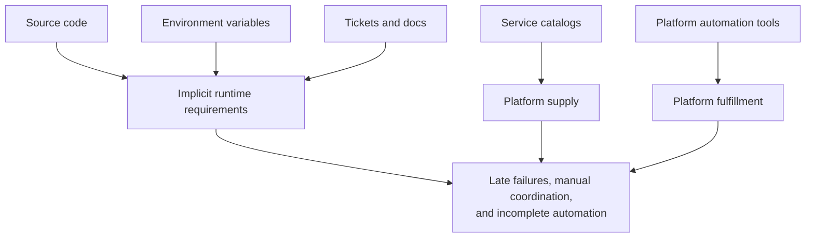
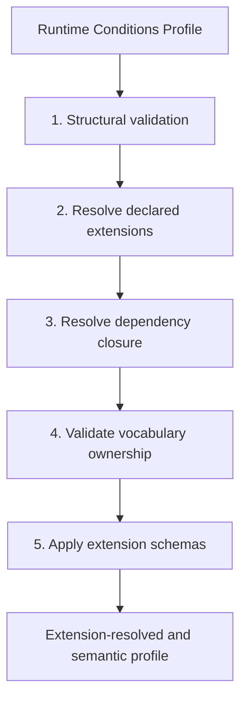
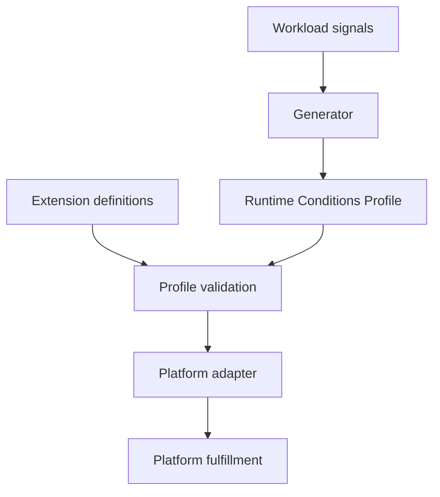
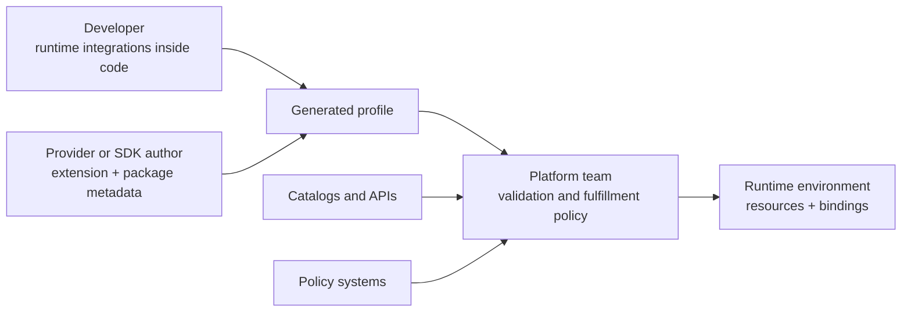

# Runtime Conditions Profiles: Portable Runtime Requirements for Cloud-Native and AI-Native Workloads

# 1. Executive Summary

Cloud-native platforms can provision infrastructure, expose reusable services, enforce policy, and automate deployment, but workload runtime requirements are still scattered across code, catalogs, and conversations. The result is a recurring handoff problem: developers know what the application needs, and platform teams know what the platform can provide, but neither side has a common reference point to drive the conversation.

A Runtime Conditions Profile is a portable, machine-readable declaration of the external runtime integrations required by one workload. It gives developers, platform teams, policy systems, catalogs, agents, and automation a shared contract for reasoning about runtime requirements before deployment.

```yaml
apiVersion: runtimeconditions.io/v1alpha1
kind: RuntimeConditionsProfile
metadata:
  name: checkout-service
workload:
  uri: https://github.com/example-org/checkout-service
  version: v1.2.3
extensions:
  - https://runtimeconditions.io/extensions/common-integrations/v1alpha1/runtimeconditions.extension.yaml
  - https://runtimeconditions.io/extensions/env-configuration/v1alpha1/runtimeconditions.extension.yaml
conditions:
  - name: request-cache
    kind: cache
    interface:
      type: key_value
      engine: redis
    configuration:
      env:
        - property: url
          name: REDIS_URL
```

This compact profile captures the core idea. The workload needs a Redis-compatible cache and can consume it through `REDIS_URL`. The profile declares that demand. The platform decides how to fulfill it.

Runtime Conditions Profiles should be auto-generated wherever possible, turning workload behavior and declared integrations into a repeatable delivery artifact. Automating the creation of the profile ensures that the resulting Conditions list, and any downstream platform resource provisioning, are tied directly to the needs of the source code.

This contract improves the software delivery lifecycle by moving dependency review earlier in the process. Runtime declarations can originate in code or SDK metadata, CI can validate the generated artifact, and platform teams can evaluate support before choosing fulfillment. Policy and security checks can also run before final manifests, while operations agents gain validated requirements to reason from instead of piecing together intent from documentation and deployment fragments.

| Persona | Benefit |
| --- | --- |
| Application developers | Declare runtime needs without becoming platform implementation experts. |
| Platform teams | Receive a concrete demand document before choosing fulfillment. |
| Security and policy teams | Evaluate workload intent earlier in the delivery flow. |
| Service providers | Publish extension vocabulary and SDK metadata for adoption through platform workflows. |

---

# 2. The Problem: Runtime Requirements Lack a Shared Contract

Deploying a service can feel like navigating a minefield. The “just deploy it” mindset often leads to failures because critical dependencies like databases, caches, or properly configured tooling are overlooked. Even when teams recognize the need for these components, they may lack awareness of the specific deployment requirements or overlook mismatched environment variables.

Meanwhile, platform teams cannot reliably know what an app needs without inspecting source code, and developers may not know how to express requirements in a platform-native way. Policy systems often see final deployment artifacts, not the application-level demand that produced them. AI agents and automation harnesses see fragments: a README, a chart, a source file, or a catalog entry.

This creates a gap between what an application needs and what the platform can safely provide. Service catalogs help, but they describe the supply side first: available APIs, service owners, provider capabilities, and catalog metadata. That is necessary, but it is not the same as a workload saying, "I require this API operation, this cache interface, these configuration inputs, and this model-serving capability." When the workload-demand side is absent, automation can pass catalog lookup but fail in a later pipeline step - resource provisioning, policy setting, or in the actual running deployment.

The result is a recurring pattern:

- A workload depends on external integrations.
- Dependencies are visible somewhere, but not in a clear portable contract.
- Platform automation cannot determine whether all dependencies can be fulfilled.
- Review and policy happen late.
- Application onboarding may revert to bespoke coordination.

Runtime Conditions Profiles make this demand explicit.



This paper's claim is that cloud-native delivery needs a portable demand-side document that can be generated, validated, extended, and consumed by platform systems.

---

# 3. The Core Model: Demand Before Fulfillment

The core model is the separation of demand from fulfillment.

In practical terms, source code uses integrations, a generator emits a profile containing requirements, and an adapter maps those requirements to environment-specific fulfillment. The profile stays focused on demand. It does not choose providers, instances, networks, secrets, or cluster topology.

That allows platform systems to remain free to fulfill that demand in environment-specific ways. A Redis-compatible cache requirement can be validated independently from any one platform and fulfilled differently across local development, staging, production, regulated environments, or multiple clouds.

In concrete terms:

| Layer | Responsibility |
| --- | --- |
| Runtime Conditions Profile | Describes workload demand. |
| Platform capability catalog or provider system | Describes what the platform can provide. |
| Adapter or platform engine | Matches demand to supply and renders fulfillment where possible. |
| Target platform | Runs the workload and provides environment-specific integration values. |

---

# 4. What a Profile Looks Like

A Runtime Conditions Profile declares the external runtime integrations required by one application workload.

The core draft defines:

- the profile document shape
- workload identity fields
- profile metadata labels
- the core Condition object shape
- extension declaration and resolution rules
- extension definition structure
- validation layers
- conformance requirements for profiles, extensions, generators, validators, and adapters

The top-level profile shape is intentionally small:

```yaml
apiVersion: runtimeconditions.io/v1alpha1
kind: RuntimeConditionsProfile

metadata:
  name: checkout-service

workload:
  uri: https://github.com/example-org/checkout-service
  version: v1.2.3

extensions:
  - https://runtimeconditions.io/extensions/common-integrations/v1alpha1/runtimeconditions.extension.yaml
  - https://runtimeconditions.io/extensions/env-configuration/v1alpha1/runtimeconditions.extension.yaml

conditions:
  - name: primary-db
    kind: datastore
    interface:
      type: relational
      engine: postgres
    configuration:
      env:
        - property: hostname
          name: DB_HOST
        - property: port
          name: DB_PORT
        - property: database
          name: DB_DATABASE
        - property: username
          name: DB_USERNAME
        - property: password
          name: DB_PASSWORD
```

Each Condition represents one external runtime dependency requirement. The core Condition shape owns only the common structure:

```yaml
conditions:
  - name: optional-condition-name
    optional: false
    kind: extension-defined-kind
    interface:
      type: extension-defined-interface-type
```

Extensions own concrete values for `kind`, `interface.type`, additional Condition fields, additional interface fields, field values, and JSON Schema validation.

The first-party extension set includes two foundational extensions:

- Common Integrations defines common integration kinds, such as `api`, `datastore`, and `cache`, and their respective interface types.
- Environment Configuration defines workload configuration inputs such as environment variable names, sensitive inputs, required/optional inputs, and alternatives like `REDIS_URL` versus `REDIS_HOST` plus `REDIS_PORT`.

Profile validation starts with core structure, and proceeds to extension resolution, dependency chaining, vocabulary ownership, and extension schemas. This gives tools a way to distinguish malformed documents from structurally valid profiles that use unresolved or semantically invalid vocabulary.



The profile must not contain secret values, protected data, personal data, customer data, or concrete target-environment values. It can name configuration inputs the workload expects, such as `DB_PASSWORD` or `TODOS_API_URL`, but the values for those inputs are supplied by platform fulfillment.

---

# 5. Extensions Scale the Model

Runtime Conditions Profiles avoid putting every possible integration vocabulary into the core specification. The core defines a stable envelope structure for defining Conditions, while extensions define the practical vocabulary that real workloads need.

An extension is best understood as a vocabulary package. It provides a place to define the concrete declarations that profiles can use:

- the kinds of Conditions that exist
- the interfaces those Conditions expose
- the fields that make those interfaces useful
- the portable values those fields can carry
- the schemas that enable automated validation

This ownership model keeps shared meaning intact by allowing extensions to form a hierarchy. This allows extensions to act as building blocks, creating composable vocabulary.

A base extension can introduce a foundational profile structure:

```yaml
spec:
  kinds:
    - name: api
    - name: datastore
    - name: cache

  interfaceTypes:
    - name: http
      targetKind: api
    - name: relational
      targetKind: datastore
    - name: key_value
      targetKind: cache
```

An additive extension can then build on that foundation without copying it:

```yaml
spec:
  dependencies:
    - https://runtimeconditions.io/extensions/common-integrations/v1alpha1/runtimeconditions.extension.yaml

  conditionFields:
    - name: configuration
      appliesToKinds:
        - cache
      appliesToInterfaceTypes:
        - key_value
```

In an extension document, those vocabulary choices appear in a small set of recurring sections:

| What the Extension Contributes | Extension Section |
| --- | --- |
| Condition categories, such as `api`, `datastore`, or `cache` | `spec.kinds` |
| Interface types for a category, such as `http` for `api` | `spec.interfaceTypes` |
| Top-level fields on a Condition, such as `configuration` | `spec.conditionFields` |
| Fields under `interface`, such as `engine`, `spec`, or `operations` | `spec.interfaceFields` |
| Portable values for paths such as `interface.engine`, `interface.operations[].method`, or `configuration.env[].property` | `spec.fieldValues` |
| Object-shape and conditional validation | `spec.schemas` |
| Vocabulary from another extension that this extension builds on | `spec.dependencies` |

The important design effect is that extensions let the specification stay small while supporting growth across domains.

Possible extension families include:

- common application integrations
- environment and secret delivery conventions
- cloud-provider service vocabularies
- AI agent memory and RAG stores
- MCP server dependencies
- model-serving accelerators and model artifact sources
- compliance and trust requirements
- network and identity interfaces
- organization-specific platform capabilities

---

# 6. Tooling Model: From Workload Signals to Validated Profile

At a high level, a practical automated workflow can be summarized as:

1. A workload's source code establishes integrations with external resources.
2. A generator emits a profile that includes requirements and environment variable names, not target values.
3. An adapter fulfills the profile.

Generators can use different signals depending on their purpose. Some may analyze source code and package metadata. Others may observe runtime behavior, such as syscall or network activity in a local development environment. Others may be driven by explicit authoring workflows or organization-specific tools. The important aspect is not the generator technique; it is a valid Runtime Conditions Profile that downstream systems can trust.

First-party AST-based tooling uses lightweight, no-op library code so developers can declare integration dependencies directly in source. The generator parses those declarations, maps them to extension-owned vocabulary, and emits the corresponding Conditions into the generated profile. The declaration code does not provision anything by itself; it gives tooling a reliable source-level signal that can be validated and carried forward.

Regardless of the generator's approach, the core flow is intentionally small:



This gives software supply chains a workflow that can fit naturally alongside other steps in a standard CI pipeline.

---

# 7. Use Cases

Runtime Conditions Profiles are useful wherever runtime demand needs to be explicit before platform fulfillment.

## 7.1 Platform Self-Service and Golden Paths

Golden paths are easier to automate when the platform can read what the workload needs. A profile can declare that an application requires a relational datastore, an HTTP API, and a cache. The platform can then match those Conditions to supported capabilities, select implementation defaults, enforce environment policies, and bind the right configuration inputs.

This keeps developers focused on application intent while leaving fulfillment to platform-owned workflows.

## 7.2 Pre-Deployment Contract Validation

A representative platform flow can validate APIs before deployment: an API Condition can declare an operation such as `GET /todos/{id}` and an expected response shape. An adapter can compare that requirement to a catalog OpenAPI document before rendering workload resources.

This pattern generalizes to:

- API compatibility checks
- dependency availability checks
- environment variable binding checks
- capability support checks

The earlier the profile is generated, the earlier these checks can run.

## 7.3 Service Catalog and API Catalog Integration

Service catalogs commonly describe providers, owners, APIs, and operational metadata. Runtime Conditions Profiles can add the workload-demand side.

A catalog may know that `todos-api` exists. A profile can say that a workload requires a specific API operation and can consume its base URL through `TODOS_API_URL`. The adapter can validate catalog compatibility and bind the resulting value into the workload.

This is different from treating the catalog as the profile. Catalogs describe available or known services. Profiles describe what this workload requires.

## 7.4 SDK and Framework-Provided Dependency Discovery

Many workloads access integrations through SDKs rather than explicit platform declarations. SDK authors can package Runtime Conditions metadata so workloads that import those SDKs can generate accurate profiles without adding application-specific configuration files.

Frameworks can provide the same signal at a higher level. A web framework, workflow engine, or agent framework could expose common integration points such as service clients, queue consumers, or model endpoints in a Runtime Conditions manifest that generators can translate into workload-level Conditions. This lets framework-mediated dependencies appear in the profile without forcing every application team to describe them by hand, or crack open the framework's source code to identify each dependency.

## 7.5 AI-Native Workloads

AI-native applications often combine tool endpoints, retrieval systems, model-serving infrastructure, and coordination services. Runtime Conditions Profiles can give those workloads a bounded representation of runtime requirements.

Examples:

- MCP servers can declare REST APIs, databases, and internal services they call.
- Agent harnesses can declare tool endpoints, sandbox requirements, and credential/configuration inputs.
- RAG agents can declare vector databases, embedding services, and document stores.
- Multi-agent systems can declare shared state stores, coordination services, and event buses.
- Model-serving applications can declare model artifact storage, accelerator requirements, and minimum GPU memory.

Just as with any vocabulary definition, accelerator and memory requirements should be expressed through extension-defined runtime capability vocabulary. A profile may declare an accelerator-compatible serving environment with enough memory for a model class and expected server libraries, while leaving target placement to platform fulfillment.

## 7.6 Agentic Ops

For Agentic Ops, the value is operational. A standardized profile format, explicit extension resolution, and validation give operations agents a common language for interpreting workload demand and platform fulfillment. Instead of inferring dependencies from unstructured documentation or final deployment output, an agent can reason over validated Conditions, explain missing platform capabilities, propose adapter mappings without seeing secret values, and validate that deployment changes satisfy declared demand.

## 7.7 Policy, Compliance, and Auditability

Profiles give policy systems such as OPA and Kyverno a demand-side artifact to evaluate before platform fulfillment is complete. A downstream platform can check approved extensions, secret mechanisms, catalog-backed API providers, and accelerator policy before resources are rendered or applied.

The same declared service-to-service communication can inform security automation. If a Checkout Service profile declares that its workload calls the Shopping Cart Service through HTTP `GET /cart/{id}`, a platform adapter can use that demand to generate a least-privilege network policy, such as a CiliumNetworkPolicy that permits only the declared L7 method and path. That turns application-level dependency knowledge into security resources that are usually hand-authored, inferred from traffic post-deployment, or omitted entirely.

The profile itself does not enforce policy or create security resources. It gives downstream platforms enough structured context to verify compliance and automate safer defaults.

## 7.8 Dependency Inventory and Migration Planning

Organizations often need to answer questions such as:

- Which workloads require Redis?
- Which workloads use a deprecated API operation?
- Which services expect `DB_PASSWORD` as an environment variable?
- Which workloads rely on an SDK-owned integration?
- Which AI workloads require a vector store or GPU-backed serving?

Generated profiles create an inventory tied directly to application demand, supporting migration planning, platform modernization, cost analysis, and incident response without relying only on separately authored deployment manifests.

---

# 8. Impact on Platform Engineering

Runtime Conditions Profiles align with Platform as a Product thinking by clarifying the contract between platform consumers and platform teams.

Even when a platform has mature automation, the handoff between developers and platform teams often still becomes manual or verbal at some point. A developer knows the source code. A platform engineer knows the available capabilities and fulfillment rules. Between those two views, the shared artifact is often a ticket, a conversation, a README, or a deployment failure.

Runtime Conditions Profiles give that handoff a common reference document.

| Role | Goal | How Runtime Conditions Profiles Help |
| --- | --- | --- |
| Application developers | Express runtime integrations without becoming platform implementation experts. | Developers declare runtime integrations inside code, or rely on SDK metadata, and review generated profiles as part of normal development. |
| Platform engineers | Understand workload demand before choosing fulfillment mechanisms. | Profiles provide a cross-cutting view of integrations and make platform capability gaps visible before deployment. |
| Service providers | Make their services easier to adopt through standard platform workflows. | Providers can publish extensions and SDK metadata that generators and adapters can consume. |

The resulting operating model leverages Runtime Conditions artifacts to inform platform automation:



This makes onboarding less dependent on bespoke interviews, helps golden paths adapt to workload demand, and lets platform teams change fulfillment implementations without changing application intent.

Even platforms that are early in their automation journey can benefit from having a concrete point of reference. A team that still relies on verbal handoffs can use a profile as the common language between developers and platform engineers. The value is similar to what OpenAPI brought to API producers and consumers - a standardized document that provides a starting point for platform adoption discussions.

---

# 9. Impact on CNCF and Adjacent Ecosystems

Runtime Conditions Profiles are an integration contract that can help CNCF and cloud-native projects cooperate more cleanly around workload demand.

## 9.1 Score

Score already has an environment-agnostic workload specification with an open-ended `resources` section for dependencies needed by the workload. The Score specification says resources can be anything and that implementations resolve resources by name, type, or other metadata.

Runtime Conditions can fit cleanly into that open-ended `resources` field. A Score implementation could import Conditions as resource declarations, emit Conditions from Score resources, or use extension vocabulary to make resource typing more deterministic while leaving implementation resolution to Score implementations.

## 9.2 Radius

Radius describes applications and dependencies while operators define environments, infrastructure, and policies. Runtime Conditions Profiles could provide a source-derived demand artifact that Radius environments and recipes consume, while Radius remains focused on application deployment and graph management.

## 9.3 Crossplane, Kratix, and Provider Control Planes

Crossplane, Kratix, and similar provider-oriented systems expose platform capabilities through APIs, compositions, promises, or internal workflows.

Runtime Conditions Profiles can act as input to adapters that translate workload demand into provider requests: cache Conditions can become Redis promises or composite resources, datastore Conditions can become platform-approved database requests, and API Conditions can trigger catalog validation and service binding. The profile does not need to know which provider system is used.

## 9.4 Backstage and Service Catalogs

Backstage and other catalog systems can benefit from workload demand metadata. Profiles can enrich catalog views with declared dependencies, expected environment variables, required API operations, and extension identifiers, helping catalogs describe both sides of an integration instead of relying only on manually maintained relationship maps.

## 9.5 OpenAPI and API Catalogs

API Conditions that declare HTTP methods and required operations can be mapped to OpenAPI catalog entries, giving adapters enough information to validate API compatibility before deployment. The same pattern can extend to GraphQL, gRPC, and other structured API contracts when providers publish machine-readable descriptions and workloads declare the operations they require.

## 9.6 OPA, Kyverno, and Other Policy Engines

Policy engines such as admission controllers, CI policy checks, and governance workflows can use profiles as earlier input.

Instead of waiting for a Kubernetes manifest, a policy system can evaluate whether the declared runtime demand is allowed, complete, and fulfillable for a target environment.

## 9.7 OpenTofu, Pulumi, and Other IaC Tools

IaC tools remain important for fulfillment. Runtime Conditions Profiles can inform which modules, recipes, compositions, or provider workflows should be invoked while staying portable across target automation stacks.

---

# 10. Recommendations

## For Application Developers

Declare runtime integrations inside code when using explicit Runtime Conditions declaration packages, rely on SDK or framework metadata where available, and review the generated profile as a normal CI artifact.

## For SDK and Framework Authors

Ship Runtime Conditions package manifests and extension definitions with SDKs or production libraries that imply external runtime integrations.

Map real user-facing source symbols, avoid secrets or target-environment choices, and include fixtures that prove representative SDK calls generate expected Conditions.

## For Platform Teams

Build adapters that consume validated profiles and map Conditions to platform capabilities. Keep fulfillment policy in platform-owned systems. Use profiles to expose onboarding gaps, catalog mismatches, unsupported dependencies, and policy issues earlier.

## For Catalog Owners

Treat Runtime Conditions Profiles as workload demand metadata that can complement provider-side catalog entries. API catalogs can validate required operations. Service catalogs can show which workloads depend on which capabilities.

## For AI-Native Application Builders

Use profiles to describe the runtime dependencies of MCP servers, agent harnesses, RAG systems, and model-serving applications with the same demand/fulfillment separation as any other workload.

## For Agentic Ops Builders

Use profiles as structured runtime context for operations agents so they can determine whether workload requirements are understood, validated, and fulfillable without inferring demand solely from documentation or deployment fragments.

## For CNCF and Ecosystem Projects

Evaluate where Runtime Conditions data can be imported, exported, validated, or transformed. The most promising integration points are workload resource declarations, platform capability APIs, service catalogs, API catalogs, policy systems, and developer workflow tools.

---

# 11. Appendices

## Appendix A: Glossary

| Term | Meaning |
| --- | --- |
| Runtime Conditions Profile | A document describing the external runtime integrations required by one workload. |
| Condition | One external runtime dependency requirement. |
| Extension | A standalone artifact defining vocabulary and validation outside the core spec. |
| Generator | A language-native tool that emits profiles from source code and package metadata. |
| Validator | A tool that checks structure, extension resolution, vocabulary ownership, and semantic schemas. |
| Adapter | A platform-specific component that maps valid profile demand to platform fulfillment. |

## Appendix B: Core Profile Summary

Required top-level fields:

- `apiVersion`
- `kind`
- `metadata`
- `workload`
- `extensions`
- `conditions`

Core-reserved Condition fields:

- `name`
- `optional`
- `kind`
- `interface`

Core-reserved interface field:

- `type`

Extension-defined vocabulary includes:

- Condition kinds
- interface types
- Condition fields
- interface fields
- field values
- JSON Schema validation schemas

## Appendix C: Language Profiler Parity Checklist

A first-party language profiler should:

- expose `discover`, `generate`, `validate-extension`, and `validate-extensions`
- discover Runtime Conditions artifacts through language-native package resolution
- validate extension definitions and dependency closure before extraction
- validate binding references against resolved vocabulary
- analyze source using native AST, symbol, type, or compiler facilities
- avoid executing workload code
- emit deterministic profile YAML
- include authoring fixtures, profile generation fixtures, and golden outputs
- generate request logger profile parity for the language implementation

## Appendix D: Source Material and References

Draft source material reviewed during preparation:

- Runtime Conditions Profile specification draft
- Runtime Conditions RFC overview
- Extension authoring material
- Extension vocabulary keyword material
- Generator discovery and end-user workflow material
- Package artifact convention material
- SDK integration material
- Language profiler feature parity specification
- Reader-facing material covering start, concepts, profile shape, code-to-profile flow, extensions, and platform adapters

External references:

- [CNCF Platforms White Paper](https://tag-app-delivery.cncf.io/whitepapers/platforms/)
- [CNCF Platform Engineering Maturity Model](https://tag-app-delivery.cncf.io/whitepapers/platform-eng-maturity-model/)
- [Platform as a Product: Understanding the Personas](https://tag-app-delivery.cncf.io/blog/paap-personas/)
- [Demystifying Composability on Platforms](https://tag-app-delivery.cncf.io/blog/composable/)
